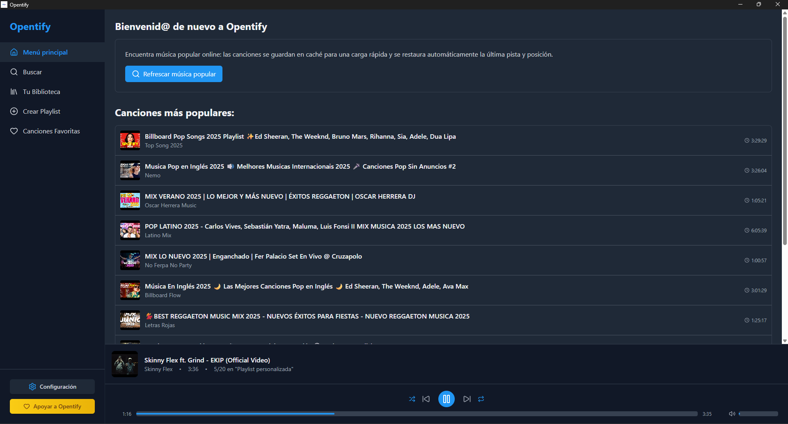
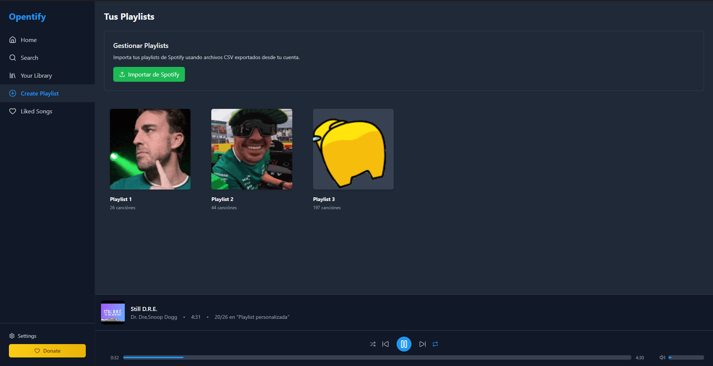

# Opentify 🎵

**Una alternativa libre y de código abierto para reproductores de música y servicios de streaming.**

Opentify es una aplicación de escritorio desarrollada con Electron que permite buscar, reproducir y gestionar música desde YouTube de forma gratuita y sin publicidad.

## ✨ Características Principales

### 🎶 Reproducción de Música
- **Búsqueda integrada**: Busca canciones que esten publicadas en YouTube
- **Reproducción local**: Descarga y reproduce tus canciones favoritas. Una vez descargadas podras escucharlas incluso sin conexion
- **Calidad de audio configurable**: Soporte para múltiples calidades de audio (128kbps, 192kbps, 320kbps)
- **Compresión de audio**: Optimización automática del tamaño de archivos

### 🎮 Controles Avanzados
- **Controles multimedia del sistema**: Integración con las teclas multimedia del teclado
- **Media Session**: Control desde notificaciones y centro de control del sistema operativo
- **Modos de repetición**
- **Reproducción aleatoria**

### 📚 Gestión de Playlists
- **Importación desde Spotify**: Importa tus playlists de Spotify mediante archivos CSV
- **Gestión visual**: Interfaz intuitiva con carátulas y información detallada
- **Búsqueda y filtrado**: Encuentra música rápidamente con opciones de ordenamiento
- **Historial de reproducción**: Mantiene registro de las últimas canciones reproducidas

### 🔧 Personalización
- **Modo oscuro/claro**: Interfaz adaptable a tus preferencias
- **Configuraciones avanzadas**: Audio, interfaz, y comportamiento personalizable
- **Minimizar a bandeja del sistema**: Mantén la música reproduciendo en segundo plano
- **Inicio automático**: Configuración para iniciar con el sistema
- **Discord Rich Presence**: Muestra lo que estás escuchando en Discord

## 📸 Showcase

### Página Principal

*Interfaz principal con historial de búsquedas y reproductor integrado*

### Gestión de Playlists

*Vista de playlists importadas con carátulas personalizadas*

### Búsqueda de Música

*Resultados de búsqueda en tiempo real con información detallada*

## 🚀 Instalación

### Requisitos del Sistema
- **Sistema Operativo**: Windows 10/11, macOS 10.14+, o Linux (Ubuntu 16.04+)
- **Memoria RAM**: Mínimo 2GB, recomendado 4GB
- **Espacio en disco**: 100MB para la aplicación + espacio para caché de música

### Instalación desde Release
1. Descarga la última versión desde [Releases](../../releases)
2. Ejecuta el instalador para tu sistema operativo
3. Sigue las instrucciones de instalación
4. ¡Disfruta de tu música favorita!

### Compilación desde Código Fuente

#### Prerrequisitos
- Node.js 16.0 o superior
- npm o yarn
- Git

#### Pasos de Instalación
```bash
# Clonar el repositorio
git clone https://github.com/aaddrruuss/opentify.git
cd opentify

# Instalar dependencias
npm install

# Ejecutar en modo desarrollo
npm run dev

# Compilar para producción
npm run build

# Crear instalador
npm run dist
```

## 🎯 Uso

### Primeros Pasos
1. **Búsqueda de Música**: Utiliza la barra de búsqueda para encontrar tus canciones favoritas
2. **Reproducción**: Haz clic en cualquier canción para reproducirla instantáneamente
3. **Controles**: Utiliza los controles en la parte inferior o las teclas multimedia de tu teclado

### Importar Playlists de Spotify
1. Ve a la sección "Your Library" → "Create Playlist"
2. Haz clic en "Importar de Spotify"
3. Selecciona tu archivo CSV exportado desde Spotify (para obtener este fichero dirigete a [Exportify](https://exportify.net/), inicia sesion y descarga los ficheros CSV de tus playlist de Spotify)
4. ¡Tus playlists se importarán automáticamente!

## 🔧 Configuración Avanzada

### Archivos de Configuración
La aplicación almacena sus configuraciones en:
- **Windows**: `%APPDATA%/opentify/opentify/settings.json`
- **macOS**: `~/Library/Application Support/opentify/settings.json`
- **Linux**: `~/.config/opentify/settings.json`

### Opciones de Configuración
```json
{
  "audioQuality": "192kbps",
  "discordRPCEnabled": true,
  "minimizeToTray": true,
  "startOnBoot": false,
  "isDarkMode": true,
  "volume": 80,
  "compressionEnabled": true
}
```

## 🏗️ Arquitectura Técnica

### Stack
- **Frontend**: React 19 + TypeScript
- **Backend**: Electron 37
- **Estilado**: Tailwind CSS
- **Empaquetado**: Webpack + electron-builder
- **Audio Processing**: FFmpeg estático

### Estructura del Proyecto
```
├── src/
│   ├── main/           # Proceso principal de Electron
│   │   ├── main.ts     # Punto de entrada principal
│   │   ├── ipcHandlers.ts  # Manejadores IPC
│   │   └── discordRPC.ts   # Integración Discord
│   └── renderer/       # Proceso de renderizado
│       ├── components/ # Componentes React
│       ├── services/   # Servicios de negocio
│       └── types/      # Definiciones TypeScript
├── assets/            # Recursos estáticos
└── build/            # Archivos compilados
```

### Flujo de Datos
1. **Búsqueda**: youtube-sr → Resultados → Interfaz
2. **Descarga**: yt-dlp-wrap → FFmpeg → Caché local
3. **Reproducción**: HTMLAudioElement → Controles → IPC

## 🤝 Contribución

### Cómo Contribuir
1. **Fork** el repositorio
2. **Clona** tu fork localmente
3. **Crea** una rama para tu feature (`git checkout -b feature/nueva-caracteristica`)
4. **Commit** tus cambios (`git commit -am 'Añadir nueva característica'`)
5. **Push** a la rama (`git push origin feature/nueva-caracteristica`)
6. **Abre** un Pull Request

### Reportar Bugs
- Utiliza el [Issue Tracker](../../issues) de GitHub
- Incluye pasos para reproducir el problema
- Adjunta logs o capturas de pantalla si es posible

### Roadmap
- [ ] Crear playlist manualmente sin tener que importar
- [ ] Agregar canciones desde la app a una playlist existente

## 🙏 Créditos y Agradecimientos

Opentify ha sido posible gracias a estas increíbles librerías de código abierto:

### 🛠️ Dependencias Principales

- **[yt-dlp](https://github.com/yt-dlp/yt-dlp)** - Herramienta de descarga de video/audio de YouTube y otras plataformas
- **[FFmpeg](https://ffmpeg.org/)** - Biblioteca multimedia completa para procesamiento de audio y video
- **[discord-rpc](https://github.com/discordjs/RPC)** - Cliente RPC para integración con Discord Rich Presence
- **[youtube-sr](https://github.com/DevSnowflake/youtube-sr)** - API de búsqueda de YouTube sin necesidad de API key

### 📦 Stack Tecnológico

- **[Electron](https://electronjs.org/)** - Framework para aplicaciones de escritorio multiplataforma
- **[React](https://reactjs.org/)** - Biblioteca de JavaScript para construir interfaces de usuario
- **[TypeScript](https://www.typescriptlang.org/)** - Superset tipado de JavaScript
- **[Tailwind CSS](https://tailwindcss.com/)** - Framework CSS utility-first
- **[Webpack](https://webpack.js.org/)** - Bundler de módulos JavaScript
- **[Lucide React](https://lucide.dev/)** - Iconos SVG para React

### 🎨 Recursos Adicionales

- **[ffmpeg-static](https://github.com/eugeneware/ffmpeg-static)** - Binarios estáticos de FFmpeg para Node.js
- **[yt-dlp-wrap](https://github.com/jschulenklopper/yt-dlp-wrap)** - Wrapper de Node.js para yt-dlp

Un agradecimiento especial a todos los desarrolladores y mantenedores de estas librerías que hacen posible que proyectos como Opentify existan. 🙌

## 📄 Licencia

Este proyecto está licenciado bajo la [Licencia MIT](LICENSE)

## ⚖️ Descargo de Responsabilidad

Opentify es una herramienta para uso personal y educativo. Los usuarios son responsables de cumplir con los términos de servicio de las plataformas de las que descargan contenido. El proyecto no almacena ni distribuye contenido con derechos de autor.

Este proyecto esta bajo desarrollo y puede tener errores de funcionamiento

---


**¿Te gusta Opentify?** ⭐ Dale una estrella al repositorio y compártelo con tus amigos músicos!

Para soporte técnico o preguntas, [abre un issue](../../issues) o contacta con el equipo de desarrollo.

**Desarrollado con ❤️ y mucha ☕ por la comunidad open source.**